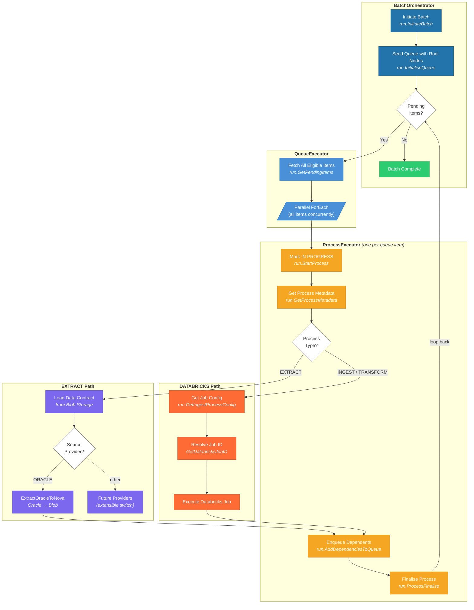
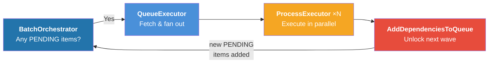
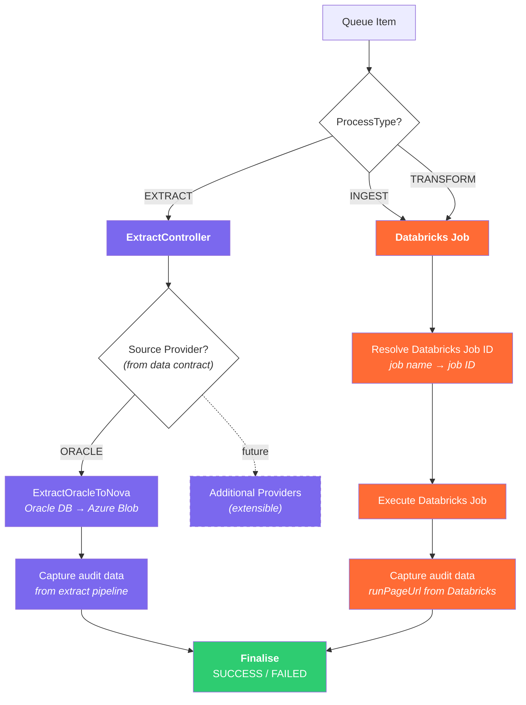
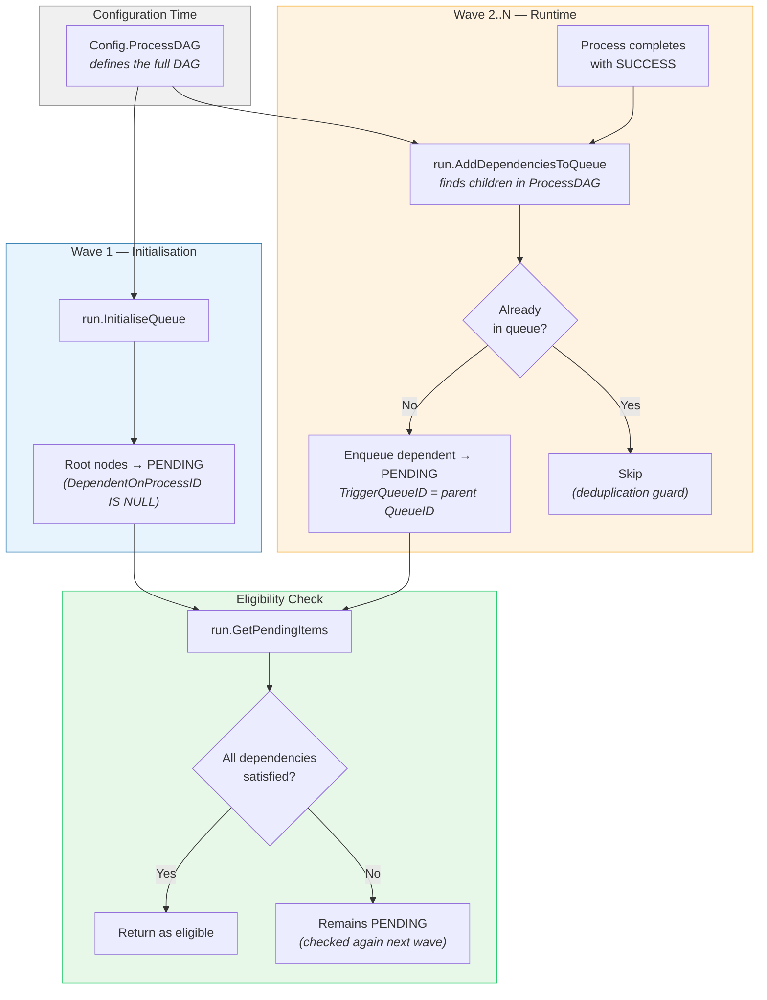

# Nova Framework - Orchestration Flow

## Recursive DAG Processing

The orchestration engine processes a directed acyclic graph (DAG) of data processes through a **recursive queue-drain pattern**. Rather than traversing the DAG in a single pass, it uses a polling loop that repeatedly discovers and executes newly-eligible work until the entire graph is complete.

### How It Works

1. **Seed** — Only root nodes (processes with no upstream dependencies) are placed into the queue at startup.
2. **Execute** — All currently-eligible PENDING items are fetched and run in parallel.
3. **Unlock** — When a process succeeds, its downstream dependents are added to the queue (if all their dependencies are now met).
4. **Repeat** — The loop re-checks for pending items. New items that were unlocked in step 3 are now eligible, so the next wave begins.
5. **Drain** — When no PENDING items remain, the loop exits and the batch is complete.

This means the DAG is not walked top-down in one shot. Instead, each iteration of the loop processes one "wave" of the graph — all items at the current frontier — and the frontier advances as dependencies are satisfied.

```
DAG Example:                          Execution Waves:

    A ──→ C ──→ E                     Wave 1: A, B    (root nodes, no dependencies)
    B ──→ D ──→ F                     Wave 2: C, D    (unlocked by A and B completing)
                                      Wave 3: E, F    (unlocked by C and D completing)
```

---

## Pipeline Interaction Diagram



---

## The Recursive Feedback Loop

The diagram above shows a linear flow, but the critical insight is the **feedback loop** between `ProcessExecutor` and `BatchOrchestrator`. Here is that loop isolated:



Each cycle through this loop processes one **wave** of the DAG:

| Loop Iteration | What Happens |
|---------------|-------------|
| **Wave 1** | Root nodes (no dependencies) are executed. On success, their direct dependents are enqueued. |
| **Wave 2** | Newly-eligible processes (whose dependencies were satisfied in Wave 1) are executed. Their dependents are enqueued. |
| **Wave N** | Continues until the queue is fully drained — all leaf nodes have completed. |

The loop terminates when `run.IsQueuePending` returns `0`, meaning every reachable node in the DAG has been processed.

---

## Conditional Execution Paths

The `ProcessExecutor` routes each queue item to the appropriate execution path based on its `ProcessType`. The routing is a two-level conditional:



**Key points:**

- **INGEST and TRANSFORM both route to Databricks** — the switch expression normalises both to the `DATABRICKS` case. The difference is in the job parameters: TRANSFORM processes receive an empty `source_ref` since they don't depend on a specific extract output.
- **EXTRACT routes through a second switch** on the data contract's `system_provider` field, making source systems pluggable. Currently only `ORACLE` is implemented.
- **Both paths converge** on the same finalisation logic — status is set to `SUCCESS` or `FAILED`, audit data is captured, and `run.ProcessFinalise` records the outcome.
- **Both paths feed into dependency resolution** — on success, `run.AddDependenciesToQueue` enqueues the next wave regardless of which execution path was taken.

---

## DAG Dependency Resolution

The dependency system uses `Config.ProcessDAG` to define a directed acyclic graph. Here is how it resolves across the execution lifecycle:



**Multi-dependency handling:** A process can depend on multiple upstream processes. `GetPendingItems` only returns it when **all** dependencies are satisfied (each upstream process has reached the required `DependencyType` status). If only some are met, the item stays PENDING and is re-evaluated on the next loop iteration.
